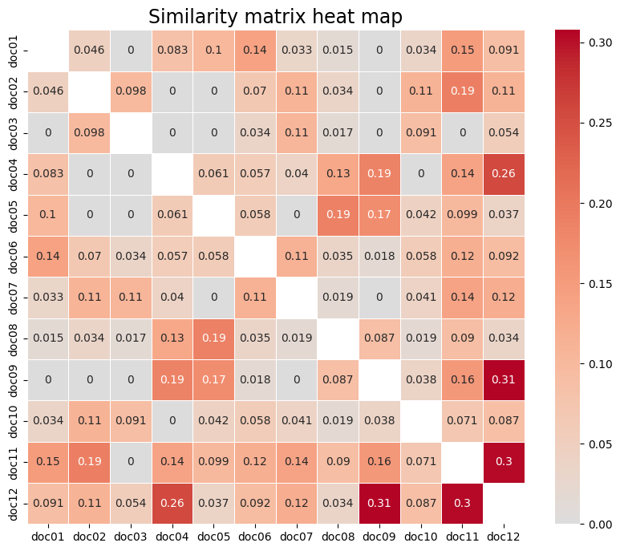
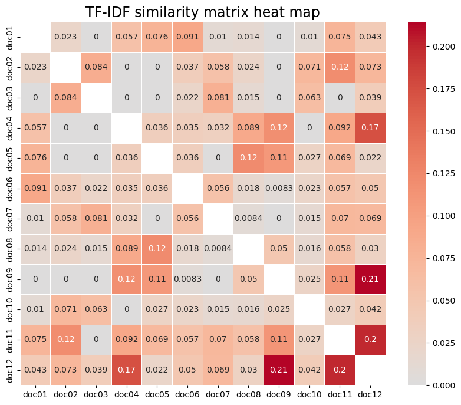

# Document Similarity with Bag-of-Words and Cosine Similarity

## 📄 Project Description
This project implements a document similarity analysis using the **Bag-of-Words (BoW)** and **TF-IDF** techniques, combined with the **cosine similarity** metric. The objective is to explore the relationship between the content of documents and their similarity using vector representations, in order to identify common patterns and themes.

The documents analysed deal with topics related to mobile technology and electric vehicles, which allows us to observe trends of similarity between documents that share these themes.

---

## 🎯 Objective
- Build vector representations of documents using **Bag-of-Words** and **TF-IDF**.
- Calculate the similarity between documents using the **cosine similarity** metric.
- Analyse the results and observe relationships between the topics covered in the documents.

---

## 🛠️ Tools and Libraries Used
- **Python**
- **NLTK** for text processing
- **NumPy** for vector manipulation
- **PyTorch** for similarity calculations
- **Scikit-learn** for the TF-IDF model
- **Matplotlib** and **Seaborn** for visualisation

---

## 📁 Project Structure
```
root/
├─── docs/                # Folder containing input documents in .docx format
├─── results/             # Folder containing the results images
├─── main.py              # Main script of the project
├─── requirements.txt     # List of project dependencies
├──── README.md           # Description file (this file)
```

## 🚀 How to Run the Project
### 1. Prerequisites
Make sure you have Python 3.8+ and the project dependencies installed. To install them, use:

```bash
pip install -r requirements.txt
```

### 2. Execute
Executes the main project file:

```bash
python main.py
```

### 3. Results
The project will generate:
- A similarity matrix calculated with **Bag-of-Words** and another with **TF-IDF**.
- Heatmaps of the similarity matrices.
- A bar chart with the most relevant words according to **TF-IDF**.

---

## 📊 Example of Results
### Similarity Heatmap (Bag-of-Words)
A heatmap showing the similarity between documents is generated using the **Bag-of-Words** representation.

<div align= "center"">
    <h2>BoW Similarity Heatmap</h2>
    
</div>

### (TF-IDF) Similarity Heatmap
Similitud entre documentos utilizando vectores TF-IDF.

<div align= "center"">
    <h2>(TF-IDF) Similarity Heatmap</h2>
    
</div>

## 🧑‍💻 Credits
Created by:
- [Susana Suárez](https://github.com/susanasrez).
- [Mara Pareja](https://github.com/marapareja17).
